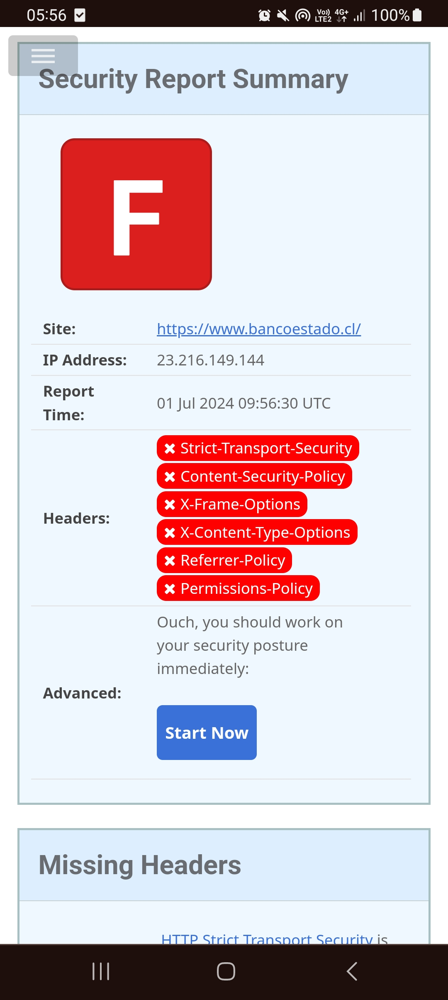
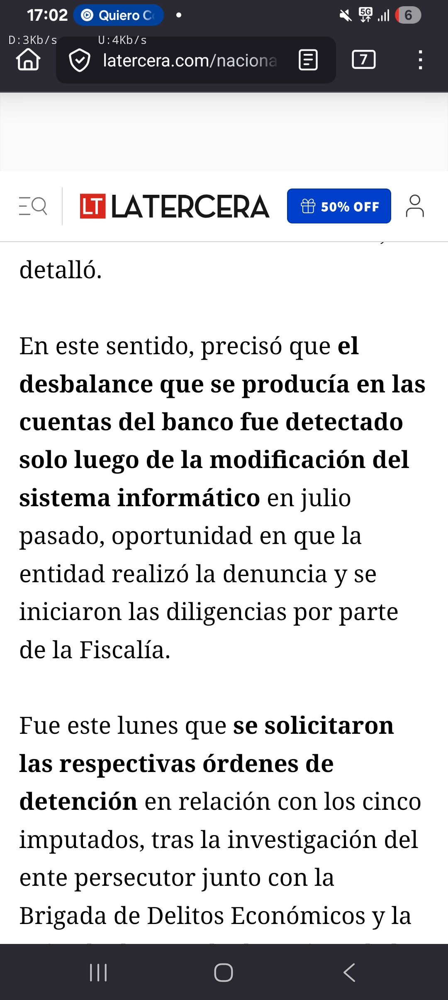
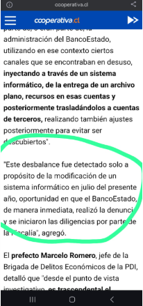

# 🛡️ Caso de Estudio: Evaluación Proactiva de Postura de Seguridad en Infraestructura Crítica Nacional

> **Divulgación responsable · Contexto:** Hallazgos de configuración de seguridad identificados de forma pasiva e independiente durante mi etapa como estudiante de Ingeniería en Informática (Duoc UC), previo a mi titulación en diciembre de 2025, y escalados a través de canales oficiales (**CSIRT de Gobierno**).
>
> Este documento demuestra tres cosas: **iniciativa** en la evaluación de postura de seguridad, **ética** en la divulgación responsable, y **criterio de ingeniería** para distinguir entre distintos tipos de riesgo. No se realizó explotación, intrusión ni acceso no autorizado de ningún tipo.

---

## ⚠️ Nota de alcance y honestidad técnica

Este caso separa deliberadamente **dos planos que no deben confundirse**:

- **Lo que yo evalué y reporté:** configuración de **cabeceras de seguridad HTTP** en dos plataformas de alto perfil. Es una observación de *perímetro* y **públicamente verificable** (cualquier persona puede reproducirla con una herramienta online). Su severidad es de tipo *hardening* / defensa en profundidad.
- **Un incidente real que afectó a BancoEstado (contexto de industria):** un fraude interno de alto impacto, ampliamente cubierto por la prensa. Este incidente **no tiene relación causal con mis hallazgos** y respondió a una superficie de ataque distinta (abuso de accesos internos), pero sirve para dimensionar el nivel de riesgo del sector.

Mantener esta distinción es, en sí mismo, parte del criterio profesional que este documento busca demostrar.

---

## 1. Metodología

Evaluación **pasiva y no intrusiva** de la postura de seguridad perimetral usando herramientas públicas de análisis de cabeceras HTTP (tipo *SecurityHeaders*). No se ejecutaron pruebas de penetración, fuzzing, ni interacción con sesiones o datos de usuarios. El objetivo fue medir la aplicación de controles de *hardening* recomendados por el estándar **OWASP Secure Headers**.

---

## 2. Hallazgos

### A. Portal bancario — `bancoestado.cl`

El análisis (01 de julio de 2024) evidenció la **ausencia de cabeceras de seguridad fundamentales**, resultando en una calificación **F**:

- `Strict-Transport-Security` (HSTS) — ausente
- `Content-Security-Policy` (CSP) — ausente
- `X-Frame-Options` — ausente
- `X-Content-Type-Options` — ausente
- `Referrer-Policy` — ausente
- `Permissions-Policy` — ausente

  
   
  <i>Fig 1. Análisis de cabeceras HTTP (01 Jul 2024): ausencia de controles de hardening recomendados por OWASP.</i>

### B. API de autenticación nacional — `accounts.claveunica.cl`

En el mismo periodo observé un patrón equivalente en el servicio de autenticación de **Clave Única**, con ausencia de mitigaciones de transporte (HSTS) y política de contenido (CSP). Esto sugería una **brecha sistémica de hardening** en la capa de transporte de servicios críticos, no un caso aislado.

### img
---

## 3. ¿Qué son estas cabeceras y por qué importan? (explicación no técnica)

Las cabeceras de seguridad son **instrucciones que un sitio le da al navegador** sobre cómo comportarse de forma segura. Cuando faltan, el navegador queda sin esas reglas de protección. En términos simples, para una persona usuaria:

- **Sin HSTS:** conectada a una red no confiable (por ejemplo, un WiFi público), existe mayor riesgo de que su conexión sea interceptada o degradada a una versión insegura.
- **Sin X-Frame-Options / CSP:** el sitio puede ser "incrustado" o imitado por terceros para engaños de tipo *phishing* o *clickjacking* (clics falsos sobre botones legítimos).
- **Sin X-Content-Type-Options:** el navegador puede interpretar archivos de forma insegura, ampliando la superficie de ataque.

En pocas palabras: **no son fallas que "roben plata" por sí solas**, pero sí debilitan las barreras que protegen a millones de usuarios frente a fraudes basados en engaño e intercepción. Son higiene básica esperable en banca y autenticación estatal.

---

## 4. Contexto de industria: por qué la madurez de seguridad es crítica

Los siguientes incidentes **son independientes de mis hallazgos** y se incluyen únicamente para dimensionar por qué la seguridad en infraestructura financiera del Estado no puede ser una preocupación secundaria.

### 4.1 Fraude interno por ~$6.170 millones (insider threat)

Ex funcionarios de BancoEstado, en conjunto con personal de una empresa proveedora de servicios informáticos (S2S), manipularon un software que transfiere dinero de forma masiva a las cuentas. El esquema explotó **cuentas rezagadas** (en desuso, sin supervisión permanente) y se extendió durante años. 

Resulta relevante que el subdirector de la Escuela de Informática y Telecomunicaciones de Duoc UC (mi casa de estudios) calificó el caso como una combinación de fallas técnicas y humanas, con gestión deficiente de controles internos.

#### 🔎 Una coincidencia temporal que vale la pena mirar

Hay un detalle que no puedo dejar de notar: mi reporte de brechas de postura fue escalado al **CSIRT de Gobierno a inicios de julio de 2024**, el mismo mes en que —según la Fiscalía y la PDI— el banco detectó internamente el desbalance millonario tras una modificación de sus sistemas.

Seamos rigurosos: **coincidencia no es causa.** La detección del fraude tuvo un origen documentado y distinto (una autodenuncia interna y una modificación de sistema), sin relación técnica con las cabeceras HTTP que yo reporté. No afirmo, ni insinúo, que mi reporte gatillara esa investigación.

Lo que sí demuestra esta coincidencia es algo genuino y valioso: **estaba mirando el lugar correcto en el momento correcto.** Mientras yo señalaba, desde afuera y de forma responsable, que la postura de seguridad perimetral de esta infraestructura estaba por debajo del estándar, la misma institución vivía —por dentro y en otra capa— una crisis de seguridad de escala nacional. El instinto de "acá hay que reforzar la seguridad" estaba direccionalmente bien. Y esa capacidad de detectar dónde está el riesgo, antes de que estalle, es exactamente lo que aporto en un rol DevSecOps.

  
  

   
  <i>Fig 2. La Tercera y Cooperativa documentando las declaraciones de la Fiscalía y la PDI: el fraude interno se detectó a raíz de una modificación informática en julio de 2024.</i>

---

## 5. Lo que aporto: enfoque DevSecOps aplicado

Este caso no es solo un hallazgo puntual: refleja cómo integro la seguridad en cada capa del desarrollo. Estos son los principios que llevo a la práctica en el código que construyo:

- **Seguridad desde el diseño (SDLC), no como parche final.** El *hardening* de cabeceras, la validación estricta de entradas y el manejo seguro de errores se definen desde el primer commit, no cuando ya está en producción.
- **Mínimo privilegio y Zero Trust.** El fraude interno de este caso demuestra que el mayor riesgo no siempre viene de afuera: segregar accesos, auditar cuentas privilegiadas y vigilar lo que está "dormido" es tan importante como blindar el perímetro.
- **Observabilidad y detección temprana.** El esquema operó años sin ser visto por falta de supervisión continua. Instrumento telemetría, logs estructurados y alertas para que los problemas se vean *antes* de escalar.
- **Defensa en profundidad.** Ninguna capa basta por sí sola; las cabeceras HTTP son una de varias barreras que deben coexistir.

**En proyectos reales he aplicado esto de punta a punta:** autenticación robusta (JWT + bcrypt, OAuth2/OIDC, MFA TOTP), rate limiting, cabeceras de seguridad, controles de acceso por roles y arquitecturas Zero Trust en plataformas en producción para +1.000 usuarios.

> 💼 **¿Buscas a alguien que construya seguro desde el día uno —o que audite lo que ya tienes?** Estoy disponible para roles y proyectos independientes en **Backend seguro, Cloud y DevSecOps**.
> 📩 [LinkedIn](https://www.linkedin.com/in/williams-diaz-450749247/) · [github.com/WilldiazRaM](https://github.com/WilldiazRaM)

---

## 6. Divulgación responsable

Los hallazgos de configuración fueron **documentados y escalados a través del CSIRT de Gobierno**, respetando los canales oficiales y sin difusión pública de detalles explotables al momento del reporte. Este documento se publica de forma retrospectiva (2024) con fines de portafolio profesional, describiendo únicamente información de postura **públicamente observable** y hechos ya cubiertos por la prensa.

---

## 📚 Referencias

### Sobre el fraude interno (verificadas)
- Interferencia — *BancoEstado descubre fraude por $6.100 millones y se querella por asociación ilícita y lavado de dinero*: <https://interferencia.cl/articulos/bancoestado-descubre-fraude-por-6100-millones-y-se-querella-por-asociacion-ilicita-y>
- La Tercera — *Detienen a cuatro sujetos vinculados al millonario fraude informático interno que afectó a BancoEstado*: <https://www.latercera.com/nacional/noticia/detienen-a-cuatro-sujetos-vinculados-al-millonario-fraude-informatico-interno-que-afecto-a-bancoestado/J5V5LMJLLJBBHPULFPY336JTEI/>
- Cooperativa — *Formalizaron a cinco detenidos por millonario fraude informático a BancoEstado*: <https://cooperativa.cl/noticias/economia/servicios-financieros/bancos/formalizaron-a-cinco-detenidos-por-millonario-fraude-informatico-a/2024-10-22/142206.html>
- CNN Chile — *Así era el mecanismo utilizado por los ex trabajadores de BancoEstado imputados*: <https://www.cnnchile.com/pais/mecanismo-utilizado-ex-trabajadores-banco-estado-imputados-millonario-fraude-interno_20241022/>
- Emol — *Cómo se gestó y qué rol cumplían los ex funcionarios detenidos*: <https://www.emol.com/noticias/Economia/2024/10/22/1146304/bancoestado-funcionarios-fraude.html>
- La Tercera — *Investigación reservada que salpica a altos ejecutivos (2025–2026)*: <https://www.latercera.com/nacional/noticia/la-desconocida-investigacion-de-la-fiscalia-por-millonario-fraude-que-salpica-a-altos-ejecutivos-de-bancoestado/>

### Estándares técnicos
- OWASP Secure Headers Project: <https://owasp.org/www-project-secure-headers/>
- CWE-693: Protection Mechanism Failure: <https://cwe.mitre.org/data/definitions/693.html>
- MDN — HTTP Strict Transport Security (HSTS): <https://developer.mozilla.org/en-US/docs/Web/HTTP/Headers/Strict-Transport-Security>

---

<i>Documento con fines de portafolio profesional. Divulgación responsable · Ética de seguridad · Enfoque DevSecOps.</i>

